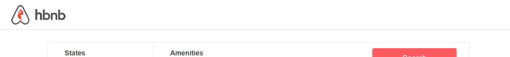
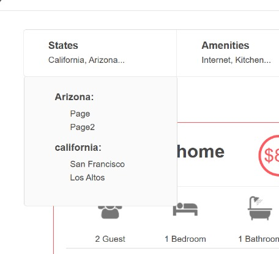
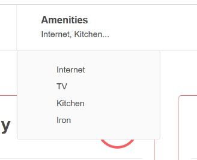
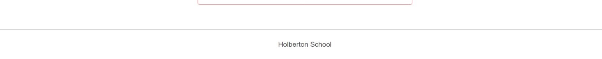
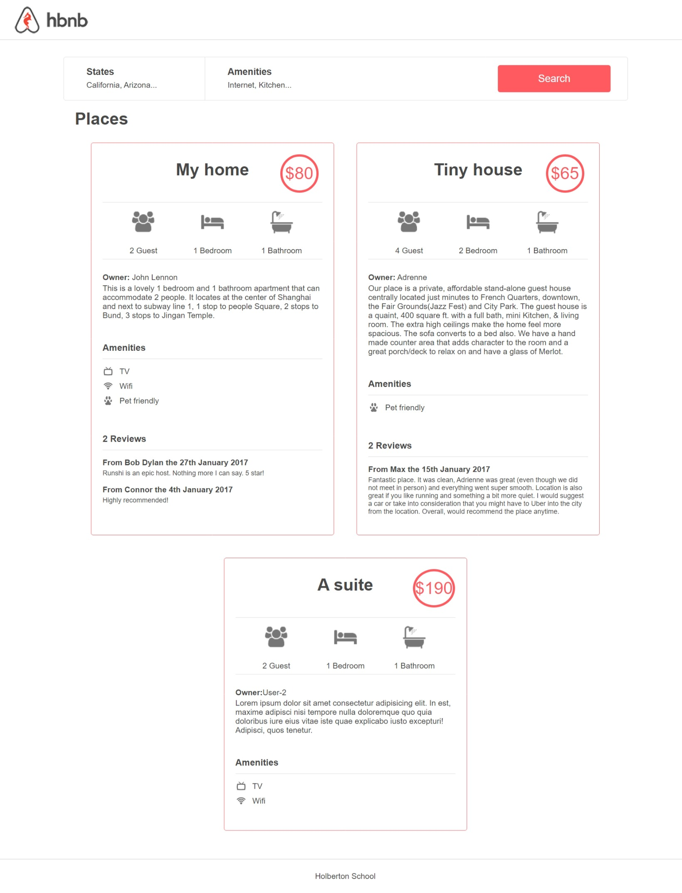

# AirBnB clone - Web static

In this project we will use Hypertext Markup Language (HTML) and Cascading Style Sheets (CSS).

## Table of contents

- [What is HTML](#what-is-html)
- [What is CSS](#what-is-css)
- [Static web content](#static-web-content)
- [End result of static web page](#end-result-of-static-web-page)
- [Author](#authors)

## What is HTML

It is the most basic component of the web and defines the meaning and structure of web content. "Hypertext" refers to links that connect web pages to each other, either within a website or between websites.

we use trademarks to label text, images and other content.

## What is Css

is a layout management language for styling elements written in a markup language such as HTML. It is the part that the user sees and with which he will interact

## Static web content

The static web is divided into 3 sections:

### Section header

Contains the part of the console logo.

### Section main

In the main section it contains all the information about the rental places and what benefits it has, it has a section where you can find the drop-down menus and the search button, after that section you find the information cards about the search places where the cards have all the detailed information about the place.

pull-down menus:

- states section dropdown menu:

- drop-down menu of the amenities section:

### section footer

In this section, the last page of the page contains the name of the institution.

## End result of static web page

## Author

- **Yerti Mariela Mosqueira Briceño**